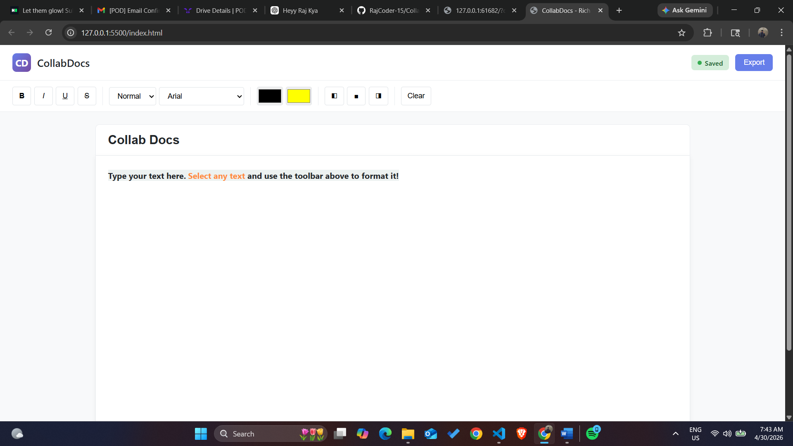

# CollabDOCS

# 📄 CollabDocs - Rich Text Editor

## 🚀 About the Project

CollabDocs is a modern **rich text editor web application** that allows users to create, edit, and format documents in real time. It provides a clean and interactive interface similar to basic document editing tools like Google Docs.

This project focuses on **frontend development**, DOM manipulation, and user experience.

---

## 🛠️ Tech Stack

* 🌐 HTML5
* 🎨 CSS3
* ⚡ JavaScript (Vanilla JS)
* 🧠 DOM Manipulation
* 💾 Local Storage

---

## ✨ Features

* 📝 Rich text editing (Bold, Italic, Underline, Strike)
* 🎨 Text color & highlight support
* 🔤 Font size and font family selection
* 📐 Text alignment (Left, Center, Right)
* 🧹 Clear formatting option
* 💾 Auto-save using Local Storage
* 📊 Live word & character count
* 📁 Export document as `.txt` file
* 🧾 Editable document title
* 🟢 Save status indicator

---

## 📸 Screenshots

### 🖥️ Editor Interface


---

## ⚡ How to Run Locally

1. Clone the repository

```bash
git clone https://github.com/RajCoder-15/CollabDOCS.git
```

2. Open the project folder

3. Run the project

* Open `index.html` in your browser

---

## 📂 Project Structure

```
## 📂 Project Structure

CollabDOCS/
│── Screenshots/
│   └── editor.png
│
│── index.html
│── style.css
│── script.js
│── README.md
---

## 💡 Key Concepts Used

* document.execCommand() for text formatting
* Event handling in JavaScript
* Local Storage for saving data
* Dynamic DOM updates

---

## 🚧 Future Improvements

* 🔥 Real-time collaboration (WebSockets / Firebase)
* 🔐 User authentication
* ☁️ Cloud document storage
* 📄 Export as PDF / DOCX
* 👥 Multi-user editing

---

## 👨‍💻 Author

**Raj**
GitHub: https://github.com/RajCoder-15

---

## ⭐ Support

If you like this project, consider giving it a ⭐ on GitHub!
